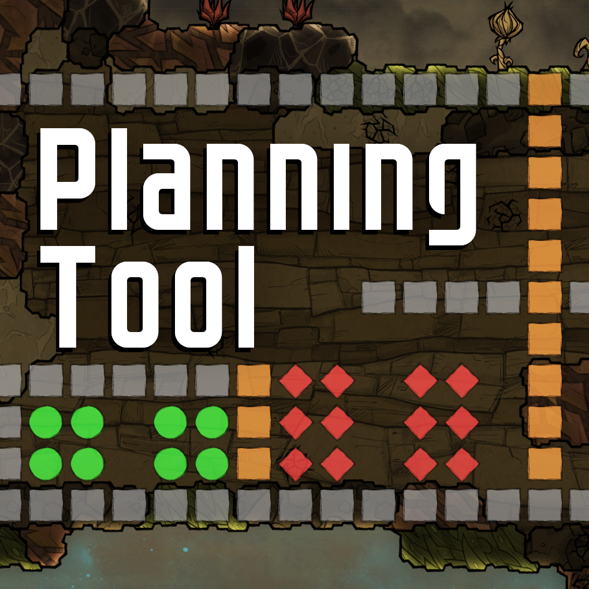

# Planning Tool

Planning Tool is a mod for Oxygen Not Included that lets you plan out a layout of your base, similar to planning tools for other games like RimWorld and Prison Architect. You can use this mod to design your base before you start building, or to experiment with different ideas or layouts.

[Planning Tool on Steam Workshop](https://steamcommunity.com/sharedfiles/filedetails/?id=2982316671)

## Report issues

Use the issue tab to report any issues with the mod. Please use the "Bug Report" form template when submitting an issue, describe the steps required to reproduce the bug, and include the player.log file.

## Contribute translations

Translations are welcome and I've made an effort to make every string translatable. If you wish to translate Planning Tool to your language or wish to improve on an existing translation read this section.

1. Clone or download this repository
2. Download and install [poedit](https://poedit.net/).
3. Open `Source/PlanningTool/translations/planningtool_template.pot` with poedit.
   - Alternatively open an existing translation .po file and choose Translation > Update from POT file...
4. Click create new translation.
5. Choose the target language.
6. Translate the strings using poedit.
7. Save the translation as "language_code.po" where language_code is the language code for your chosen language (e.g. en_US, da_DK, etc), poedit should automatically fill this out.
8. Zip the .po file, or rename extension to .txt, so that it can be attached to a github comment
9. Create a new issue using the "Submit Translation" issue form template

I also welcome pull requests if you know what you are doing.

Official guide for translating ONI for reference: https://forums.kleientertainment.com/forums/topic/74765-creatingusing-translation-files-updated-august-22nd-2017/

## Development setup

The project has been tested to successfully be imported into Visual Studio 2019 and Rider without problems.

Clone the repository into a folder of your choice. Open the solution file (*.sln) with either Visual Studio or Rider. If your installation of Oxygen Not Included is installed in another place than the default Steam folder on C:, open `Directory.Build.props` and modify the OxygenNotIncludedDllsPath attribute to point to the correct `Managed` folder in Oxygen Not Included directory (it should contain Assembly-CSharp.dll among others).

Nuget packages are defined in packages.config and should be automatically installed first time you open the solution.

Two configurations are defined, `Debug` and `Release`. Release is configured to merge PLib.dll into the final file using ILRepack.

Build the solution, Build > Build Solution. The build output directory is set to Dist at the git repository root. Copy or create a junction link to Klei's local mods location: `%userprofile%\Documents\Klei\OxygenNotIncluded\mods\Dev`

### Configuration files

This section will describe the configuration files included in this repository.

`Directory.Build.props` defines Oxygen Not Included managed directory as well as ReferencePath that points to it. ReferencePath takes precedence over referenced assemblies HintPath, to properly resolve dll locations.

Since PLib.dll is required and the recommended way to include the dll is to bundle it, ILRepack is used to merge the output assembly with PLib to end up with a single dll.

`ILRepack.targets` defines the ILRepack build step that merges dlls, as well as deleting left over files. ILRepack will only run as part of the Release configuration.

`ILRepack.Config.props` defines a few properties to match the recommended build settings per PLib docs.
